# Commercial Performance & Discount Risk Analysis

An e-commerce case study examining sales, profitability, purchasing activity, and discount-related margin risk across products, customer segments, and regions from 2014 to 2017.

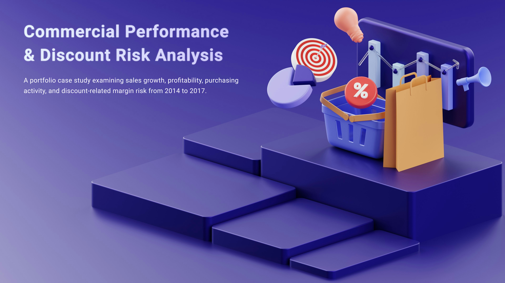

## Overview

### Business Context

For this case study, the business is referred to as Supermarket Indonesia. It is an e-commerce company offering devices, furniture, and office supplies to both individual and business customers. The company operates across ten provinces in Indonesia, serving markets from the western to the eastern regions of the country.

### Business Objective

This analysis evaluates Supermarket Indonesia's commercial performance from 2014 to 2017 by examining changes in sales, profitability, and purchasing activity over time. It also identifies the products, customer segments, and regions that consistently delivered the strongest and weakest results, highlighting where performance was concentrated and where opportunities for improvement emerged.

The analysis further investigates how profitability varied across discount levels. While discounts can support conversion, inventory clearance, customer retention, and competitive pricing, heavier discounting can erode margins when incremental sales fail to offset the reduction in unit profitability. Identifying discount levels associated with weaker financial outcomes, and determining where high-discount, loss-making activity is concentrated, therefore helps reveal potential sources of margin pressure and commercial risk.

### Outcome

The resulting insights can support:

- Performance monitoring by tracking monthly and quarterly changes in sales, profitability, and purchasing activity.
- Resource prioritization by identifying where strong performance can be reinforced and where weaker performance may warrant further investigation across products, customer segments, and regions.
- Discount governance by pinpointing discount levels associated with weaker profitability and the areas where high-discount, loss-making activity is most concentrated.

## Dataset

This project uses a synthetic e-commerce dataset provided by Dicoding Indonesia, containing line-item-level transaction records from 2014 to 2017, along with customer and geographic information.

### Data Structure

The original dataset contains 10,493 line-item-level transaction records, with each record representing an individual product within a customer order.

#### Analysis Variables

- **Identifiers:** `row_id` uniquely identifies each line-item record, while `order_id` identifies the customer order to which the line item belongs. Multiple records may therefore share the same `order_id`.
- **Temporal:** `tanggal_pemesanan` records the date on which the order was placed.
- **Transactional and financial:** `penjualan`, `kuantitas`, `diskon`, and `keuntungan` represent gross sales value, units sold, discount rate, and resulting profit, respectively.
- **Product:** `sub_kategori` identifies the product sub-category associated with each line item.
- **Customer:** `segmen` identifies the customer segment associated with each line item.
- **Geographic:** `provinsi` identifies the province associated with each line item.

## Analytical Questions

To address the business objective, the analysis was guided by four analytical questions:

1. What was the overall commercial performance from 2014 to 2017, and how did it change over time in terms of net sales, profit, profit margin, order volume, quantity sold, average order value, and units per transaction?

2. Which product sub-categories, customer segments, and provinces consistently delivered the strongest and weakest commercial performance from 2014 to 2017?

3. How did net sales, profitability, and order volume vary across discount levels from 2014 to 2017?

4. Which product sub-categories, customer segments, and provinces had the highest concentration of high-discount, loss-making line items from 2014 to 2017?

## Data Preparation

### Data Assessment

The dataset was assessed before analysis using Google Sheets features, including field formatting, Column Stats, Data Cleanup, and descriptive statistics.

- **Data types and formats:** Fields were generally stored using appropriate data types. `penjualan` and `diskon` were numeric but had not yet been formatted as currency and percentage values, respectively.
- **Missing values:** Missing values occurred only in non-analytical fields: `tanggal_pengiriman`, `kota`, and `kode_pos`. All analytical fields were complete.
- **Duplicate rows:** Data Cleanup identified 417 exact full-row duplicates, in which `row_id` and every other field were identical. These records therefore represented duplicated observations rather than distinct transactions.
- **Value validity:** Column distributions and descriptive statistics revealed no unexpected or invalid values.
- **Data consistency:** Inconsistent capitalization was identified only in `kota`. No consistency issues were identified in the analytical fields.

### Data Cleaning

The following transformations were applied before analysis:

- **Data formatting:** `penjualan` was formatted as currency and `diskon` as a percentage.

- **Missing values:** No imputation was required for analytical fields. Missing `tanggal_pengiriman` values were retained because there was no reliable basis for inferring the actual shipping dates. Missing `kota` and `kode_pos` values were filled using the provided geographic reference data.

- **Cleaned fields:** Original fields were retained, while imputed or standardized values were stored in new fields using the `clean_` prefix.

- **Duplicate removal:** The **417 exact full-row duplicates** were removed using Data Cleanup, leaving **10,076 line-item records**.

- **Data consistency:** Capitalization inconsistencies in `kota` were resolved when the field was rebuilt using the geographic reference data.

- **Geographic standardization:** `DI Yogyakarta` was mapped to `Daerah Istimewa Yogyakarta` in Data Studio to ensure consistent geographic rendering. The underlying dataset remained unchanged.

### Feature Engineering

Additional variables were derived to support the analysis.

| Feature           | Derivation                         | Analytical Purpose                     |
| ----------------- | ---------------------------------- | -------------------------------------- |
| `year`            | Extracted from `tanggal_pemesanan` | Annual performance analysis            |
| `quarter`         | Derived from `tanggal_pemesanan`   | Quarterly performance analysis         |
| `year_month`      | Derived from `tanggal_pemesanan`   | Monthly performance analysis           |
| `discount_amount` | `penjualan × diskon`               | Monetary value of the discount applied |
| `net_sales`       | `penjualan - discount_amount`      | Sales value after discount             |

## Exploratory Analysis

### Dataset Overview

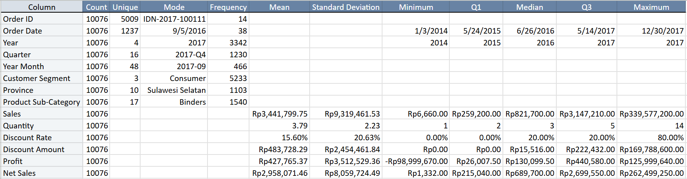

After cleaning, the dataset contains 10,076 line-item records across 5,009 orders, covering 2014 to 2017, 3 customer segments, 10 provinces, and 17 product sub-categories. Transaction values vary substantially, discount rates range from 0% to 80%, and line-item profitability includes both profitable and loss-making outcomes.

### Question 1: Overall Commercial Performance and Changes

#### Methodology

Commercial performance from 2014 to 2017 was evaluated using net sales, profit, profit margin, order volume, quantity sold, average order value (AOV), and units per transaction (UPT). The analysis assessed overall performance and changes over time at annual, quarterly, and monthly levels.

Key calculations:

- **Net Sales** = Gross Sales − Discount Amount
- **Profit Margin** = Total Profit ÷ Total Net Sales
- **Order Volume** = Distinct count of orders
- **AOV** = Total Net Sales ÷ Order Volume
- **UPT** = Total Quantity Sold ÷ Order Volume
- **MoM / QoQ Growth** = Current Period Net Sales ÷ Previous Period Net Sales − 1
- **YoY Growth** = Current Period Net Sales ÷ Same Period in the Previous Year − 1

#### Key Findings

##### 1. Net sales and profitability increased substantially from 2014 to 2017

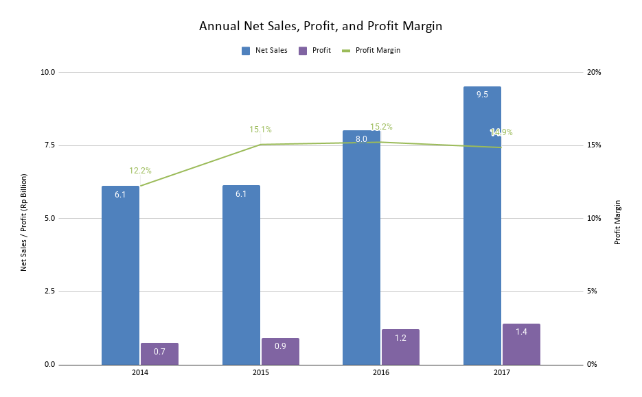

Annual net sales rose from approximately Rp6.12B to Rp9.53B, an increase of 55.8%. Profit increased 89.3%, from about Rp748M to Rp1.42B, while profit margin improved from 12.2% to 14.9%. Growth accelerated particularly sharply in 2016, with quarterly YoY net sales growth reaching 40.96% in Q1 and 51.53% in Q2.

##### 2. Expansion was driven primarily by more orders rather than larger baskets

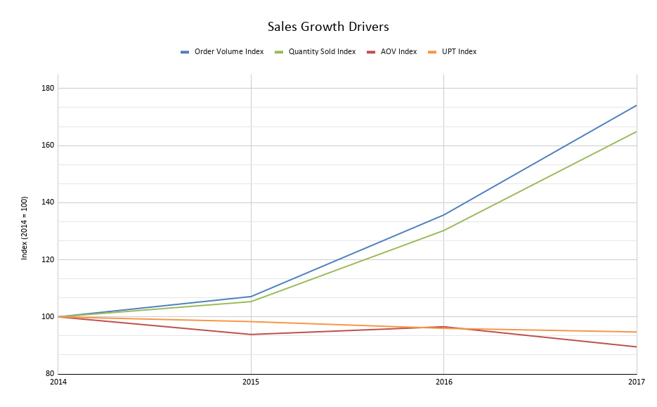

Order volume increased 74.1%, from 969 to 1,687 orders, while quantity sold rose 64.9%, from 7,628 to 12,579 units. Meanwhile, AOV declined 10.5%, from approximately Rp6.31M to Rp5.65M, and UPT decreased 5.3%, from 7.87 to 7.46. Net sales growth therefore coincided with substantially higher order volume and quantity sold, despite lower average order values and slightly fewer units per transaction.

##### 3. Performance showed a recurring seasonal pattern

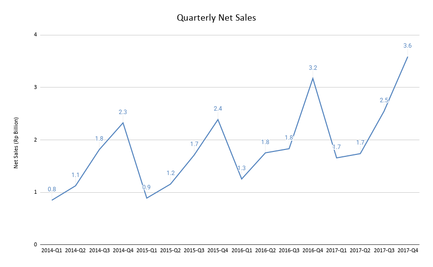

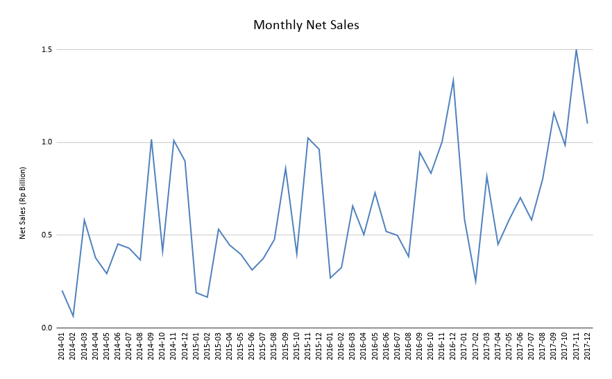

Q4 generated the highest quarterly net sales in every year, rising from approximately Rp2.33B in 2014 to Rp3.59B in 2017. Q1 consistently declined from the preceding Q4 peak, while monthly performance was generally stronger from September through December, indicating a recurring year-end concentration in commercial activity.

##### 4. Higher net sales did not always coincide with stronger profitability

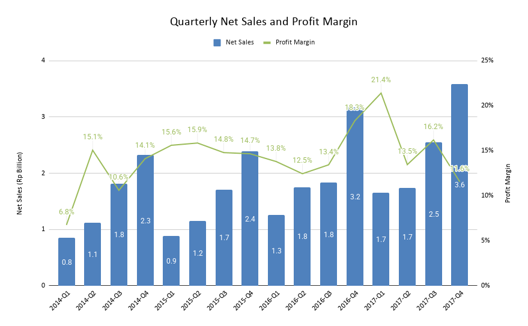

In Q4 2017, net sales reached a record Rp3.59B, up 13.09% YoY, yet profit fell to approximately Rp414.6M and profit margin declined to 11.56%, from 18.35% in Q4 2016. Profit decreased by approximately 28.8% despite higher net sales, demonstrating that net sales growth did not necessarily translate into stronger profitability.

### Question 2: Strongest and Weakest Commercial Performance by Business Dimension

#### Methodology

Commercial performance was compared across product sub-categories, customer segments, and provinces using net sales and profit as the primary measures. Profit margin, order volume, AOV, ranking consistency, and recurring losses provided additional context.

For each entity:

- **Net Sales Rank** and **Profit Rank** were calculated for each year from 2014 to 2017.

- **Commercial Rank** = (Net Sales Rank + Profit Rank) ÷ 2.

- **Average Commercial Rank** = Average of the annual Commercial Ranks from 2014 to 2017.

- Tied values received the same rank, and lower ranks indicate stronger combined net sales and profit performance.

- **Commercial Rank SD** measures variation in annual Commercial Rank across the four years; lower values indicate more stable rankings over time.

- Lower values indicate more stable rankings over time.

- **Loss-Making Years** counts the number of years in which profit was negative.

This approach provides a comparative prioritization framework across scale, profitability, and consistency.

#### Key Findings

##### 1. Phones were the strongest-performing sub-category overall

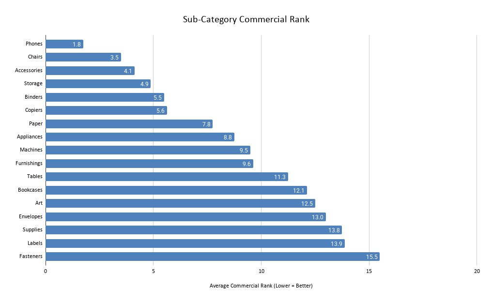

Phones recorded the lowest (strongest) average commercial rank of 1.75 and generated the highest net sales at approximately Rp4.25B, alongside Rp670.8M in profit. The sub-category remained profitable in every year and showed strong ranking consistency, with a commercial rank SD of 0.56. Chairs also generated substantial net sales, but their 9.52% profit margin and weaker profit ranking made their overall performance less balanced.

##### 2. Weakness differed between low commercial contribution and sustained unprofitability

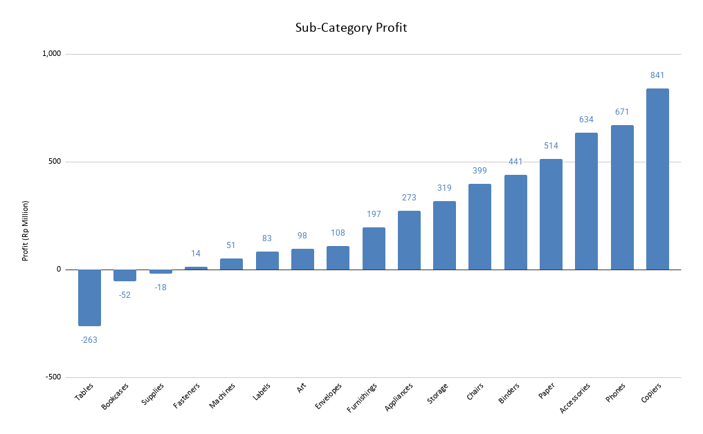

Fasteners recorded the weakest average commercial rank of 15.50, reflecting their relatively small contribution to net sales and profit despite remaining profitable in every year. Tables showed the clearest profitability weakness, generating an overall Rp262.9M loss, a −10.66% profit margin, and losses in all four years. Bookcases and Supplies also showed recurring profitability concerns, recording losses in three of four years.

##### 3. Customer-segment commercial rankings were completely stable

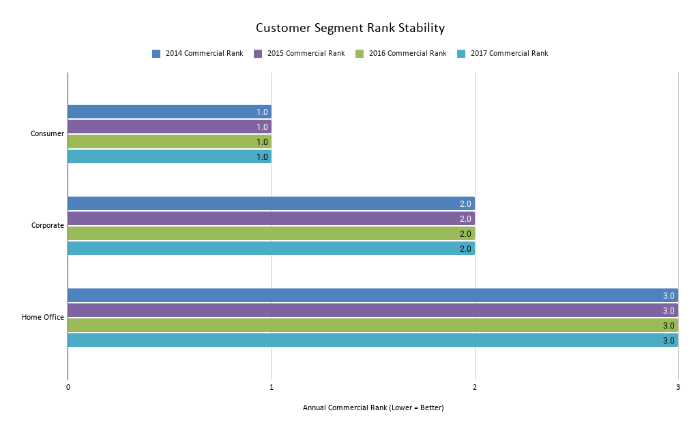

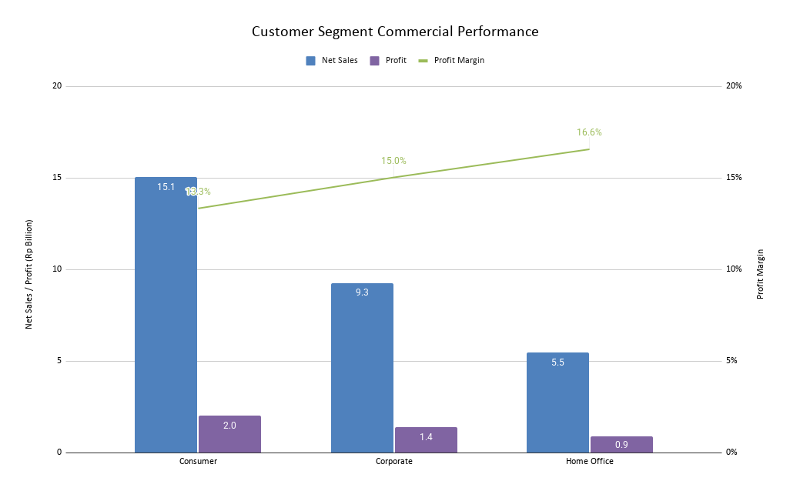

Consumer ranked first in every year, Corporate second, and Home Office third, resulting in a commercial rank SD of 0.00 for all three segments. Consumer generated the largest contribution, with approximately Rp15.06B in net sales and Rp2.01B in profit, while Home Office achieved the highest profit margin at 16.57%. Its weaker commercial rank therefore reflected smaller scale rather than weaker profitability.

##### 4. Jawa Timur showed the strongest balanced provincial performance

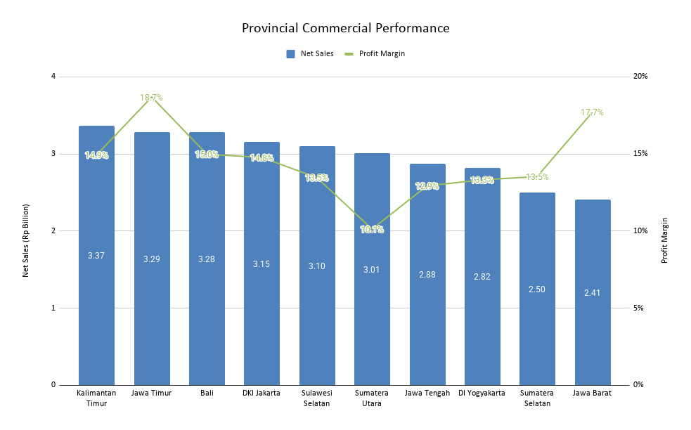

Jawa Timur recorded the lowest (strongest) average commercial rank of 3.63, while generating approximately Rp3.29B in net sales, the highest provincial profit at Rp614.1M, and the highest profit margin at 18.69%, with no loss-making years.

##### 5. Provincial weakness was distributed across different dimensions

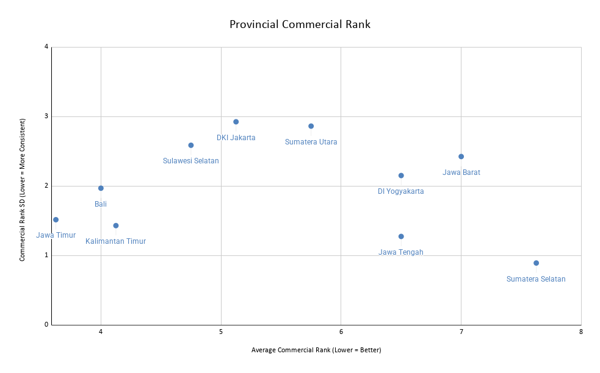

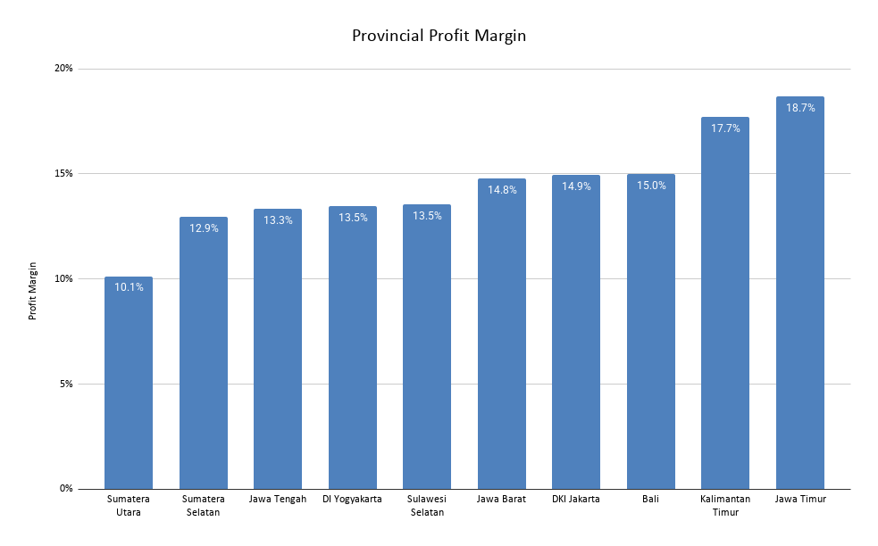

Sumatera Selatan recorded the weakest average commercial rank of 7.63 but remained profitable in every year and showed relatively stable rankings, with a commercial rank SD of 0.89. Sumatera Utara recorded the lowest provincial profit margin at 10.13% and the greatest ranking variability, with a commercial rank SD of 3.03, alongside one loss-making year. These results indicate that low commercial contribution, weaker profitability, and ranking inconsistency were not concentrated in the same province.

### Question 3: Commercial Performance Across Discount Levels

#### Methodology

Commercial performance was compared across the observed discount levels from 2014 to 2017 using net sales, profit, and profit margin. Associated order volume provided additional context on the level of purchasing activity at each discount rate.

Key calculations:

- **Net Sales** = Gross Sales − Discount Amount
- **Profit** = Aggregate profit or loss within each discount level
- **Profit Margin** = Total Profit ÷ Total Net Sales
- **Associated Order Volume** = Distinct count of orders containing at least one line item at each discount level

A single order may contain line items with different discount rates. Associated order volumes are therefore not additive across discount levels and should not be reconciled with the overall distinct-order count.

Exact observed discount rates were retained rather than grouped into bands, allowing changes in profitability to be evaluated directly across increasing discount levels.

#### Key Findings

##### 1. Commercial performance was concentrated at the 0% and 20% discount levels

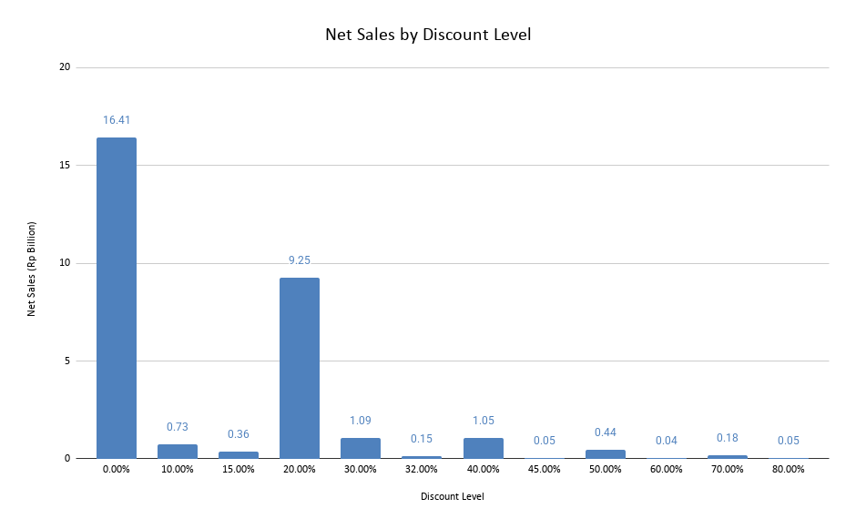

The 0% discount level generated approximately Rp16.41B in net sales and Rp4.85B in profit, while the 20% level generated Rp9.25B in net sales and Rp1.37B in profit. Together, these two discount levels accounted for approximately 86.1% of total net sales.

##### 2. Profitability deteriorated sharply from the 30% discount level onward

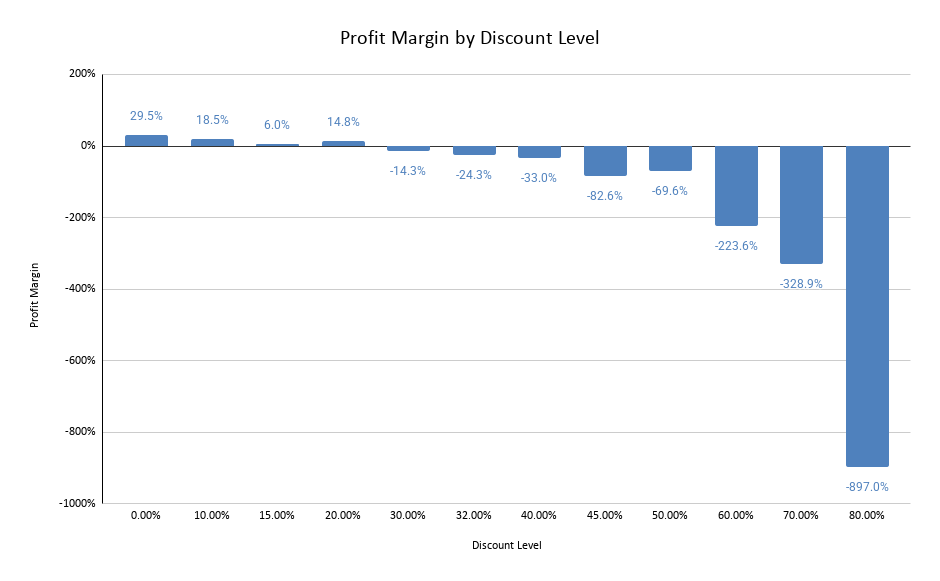

Profit margins remained positive through 20%, ranging from 5.97% to 29.53%, before falling to −14.30% at 30%. Every observed discount level above 30% was also loss-making, with particularly severe negative margins at 60%, 70%, and 80%.

##### 3. High-discount activity generated limited net sales but substantial losses

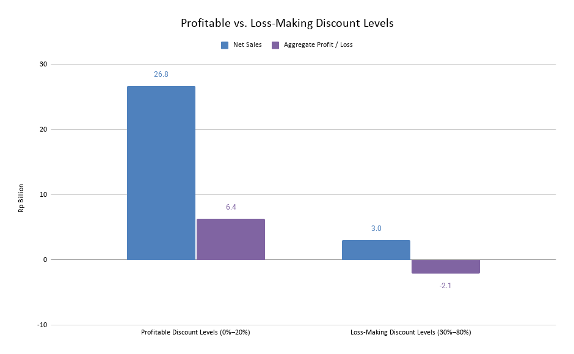

Discount levels from 30% to 80% accounted for only 10.2% of total net sales, or approximately Rp3.05B, but generated an aggregate loss of about Rp2.06B. These losses offset a substantial portion of the profit generated at lower discount levels.

##### 4. The most severe discount risk differed by measure

The **70% discount level** generated the largest absolute loss at approximately **−Rp601.1M**, while the **80% level** recorded the lowest profit margin at **−897.03%**. These levels had associated order volumes of **344 and 250**, respectively, indicating that extreme-discount activity was present across hundreds of orders rather than being confined to isolated transactions.

### Question 4: Concentration of High-Discount, Loss-Making Activity

#### Methodology

High-discount, loss-making activity was evaluated at the line-item level across product sub-categories, customer segments, and provinces from 2014 to 2017.

A risk line item was defined as:

Discount ≥ 30% and Profit < 0

The 30% discount threshold reflects the observed profitability breakpoint identified in the discount analysis, where aggregate profit margin became negative and remained negative at all higher observed discount levels.

Key calculations:

- **Risk Line Items** = Number of qualifying line items
- **Risk Concentration** = Risk Line Items ÷ Total Line Items within the entity
- **Risk Net Sales** = Total Net Sales from qualifying line items
- **Loss Exposure** = Absolute total loss from qualifying line items; unlike aggregate profit or loss, this measure excludes profitable line items

Risk concentration was used as the primary comparison measure because it adjusts for differences in entity size. The remaining measures provide complementary context on the frequency, sales scale, and financial impact of high-discount, loss-making activity.

#### Key Finding

##### 1. High-discount, loss-making line items accounted for 13.44% of all line-item activity

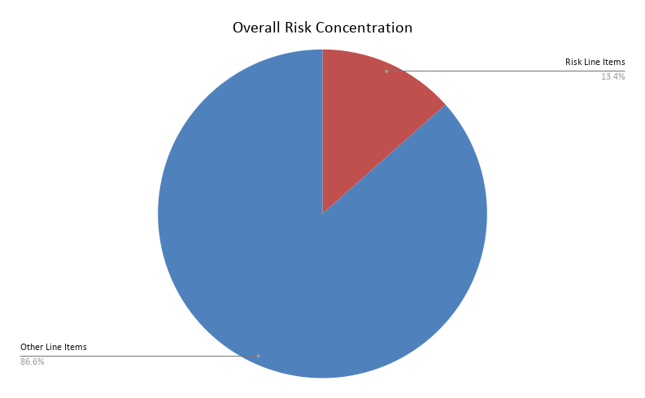

Of 10,076 line items, 1,354 met the risk definition. These line items generated approximately Rp2.74B in net sales and accounted for Rp2.11B in loss exposure.

##### 2. Product-level risk was concentrated in several sub-categories

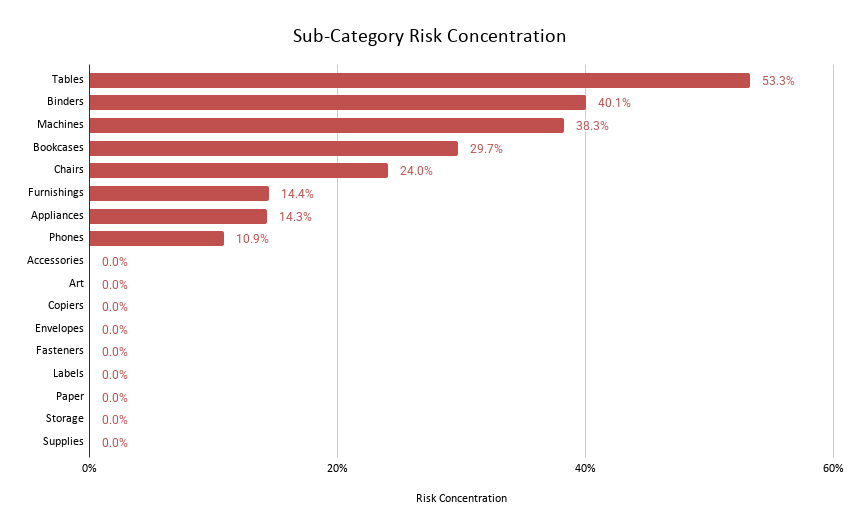

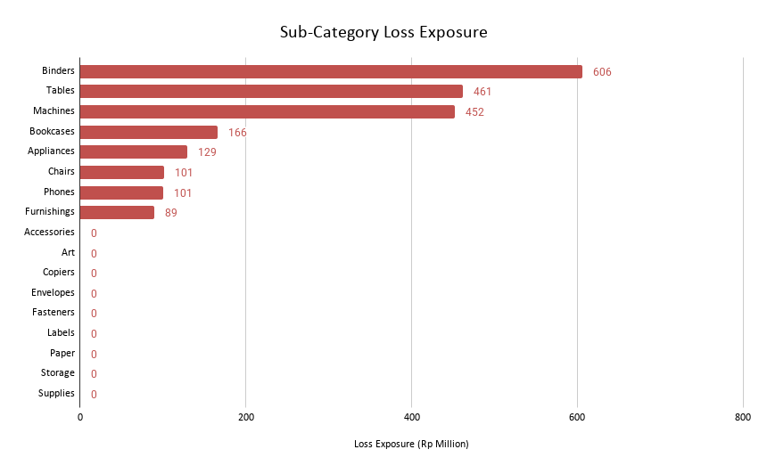

Tables recorded the highest risk concentration at 53.25%, followed by Binders at 40.06% and Machines at 38.26%. Binders also contained 617 risk line items, representing approximately 45.6% of all risk line items, and recorded the largest sub-category loss exposure at Rp606.2M. Tables and Machines followed with approximately Rp461.4M and Rp451.8M in loss exposure, respectively.

##### 3. Risk concentration was similar across customer segments

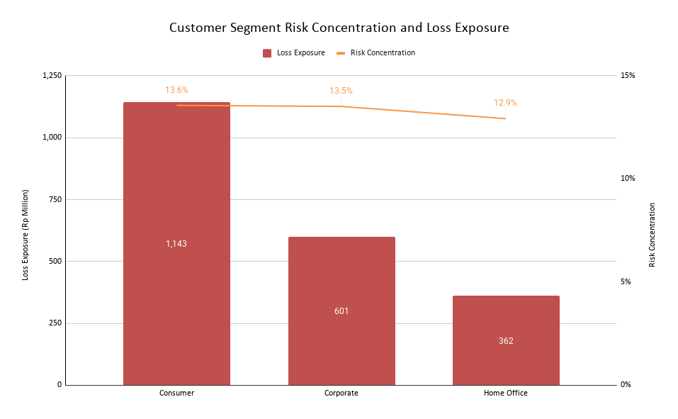

Consumer recorded the highest risk concentration at 13.57%, followed closely by Corporate at 13.52% and Home Office at 12.92%. Consumer nevertheless had the greatest absolute exposure, with 710 risk line items and approximately Rp1.14B in loss exposure, reflecting its larger overall scale.

##### 4. Geographic risk frequency and financial exposure did not identify the same province

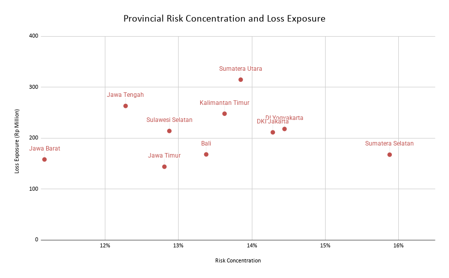

Sumatera Selatan recorded the highest risk concentration at 15.88%, followed by DI Yogyakarta at 14.45% and DKI Jakarta at 14.29%. Sumatera Utara, however, recorded the largest provincial loss exposure at approximately Rp314.7M, despite a lower risk concentration of 13.85%. A higher concentration of risk line items therefore did not necessarily correspond to greater monetary loss exposure.

### Conclusion

Commercial performance strengthened substantially from **2014 to 2017**, with net sales, profit, and profit margin increasing overall. Growth was driven primarily by higher order volume and quantity sold rather than larger average order values, while performance showed a recurring year-end peak.

Performance was uneven across business dimensions. **Phones** delivered the strongest overall sub-category performance, **Consumer** consistently led customer segments, and **Jawa Timur** showed the strongest balanced provincial results. Weakness also took different forms: some entities contributed relatively little to overall performance, while others showed persistent losses or greater ranking instability.

Discount analysis revealed a clear profitability breakpoint. Profit margins remained positive through **20% discounts** but became negative from **30% onward**. Although high-discount activity represented a relatively small share of net sales, it was associated with substantial losses.

High-discount, loss-making activity was most concentrated in specific product sub-categories, particularly **Tables, Binders, and Machines**. Risk concentrations were broadly similar across customer segments, while provincial risk concentration and loss exposure did not always occur in the same locations.

Overall, the findings indicate that commercial growth should be evaluated alongside **profitability, discount intensity, and loss exposure**, rather than sales scale alone.

## Dashboard

An interactive Data Studio dashboard summarizes the analysis across five areas: annual overview, quarterly and monthly commercial performance, performance by business dimension, discount performance, and risk analysis. The dashboard also includes filters for time periods, product sub-categories, customer segments, and provinces.

**Screenshot:**

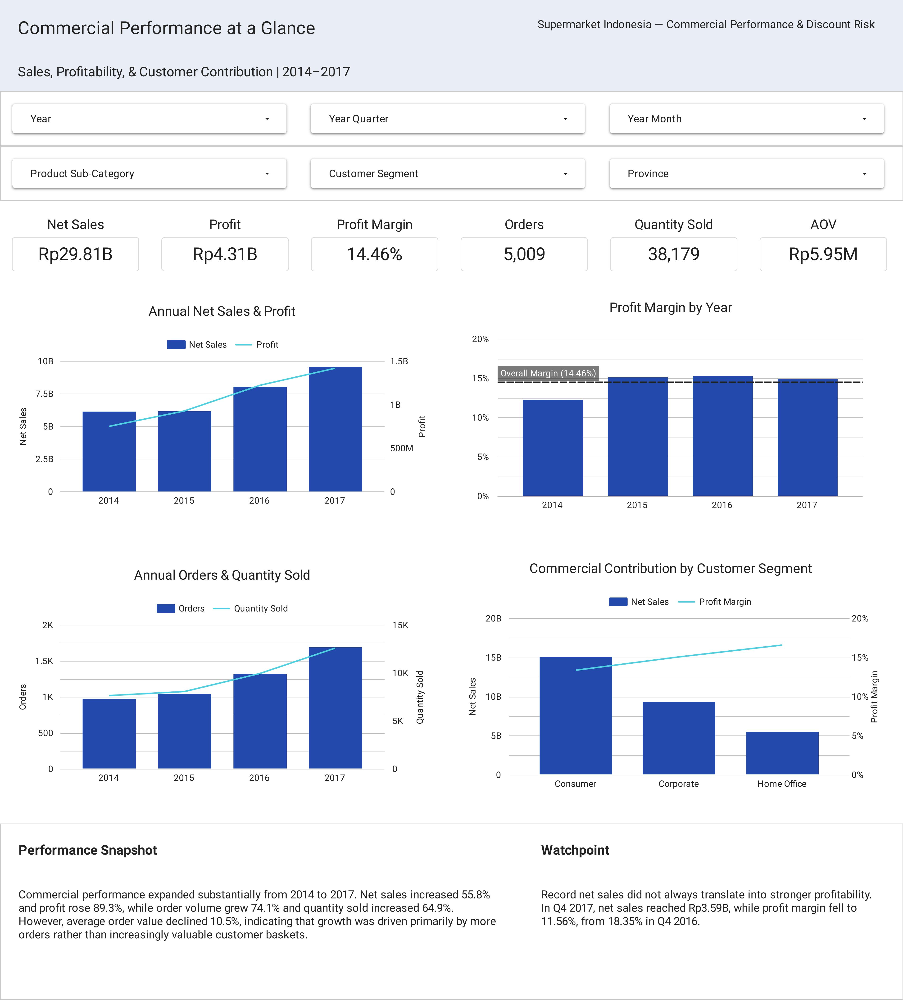

**Dashboard:** [View in Google Data Studio](https://datastudio.google.com/reporting/9b0eee36-cb31-4a41-bf7c-8d2b9de1a000)

## Business Recommendations

- **Introduce a review threshold at 30% discounts.** Treat discounts of 30% or more as exceptions requiring approval and profitability review, as aggregate profit margin was negative at every observed discount level from 30% upward.

- **Prioritize Tables, Binders, and Machines for corrective review.** Examine pricing, cost structure, and promotional practices in these sub-categories. Tables warrant particular attention because they were loss-making in all four years, while Binders and Machines showed substantial high-discount loss exposure.

- **Reinforce consistently strong areas.** Prioritize profitable growth in Phones, Jawa Timur, and Consumer, while assessing whether the higher-margin Home Office segment can be expanded without eroding profitability.

- **Test ways to improve AOV and UPT.** Use cross-selling, bundles, and complementary-product offers as alternatives to deeper discounting, then evaluate whether they increase basket value or units per transaction profitably.

- **Plan around the observed year-end demand pattern.** Align commercial and operational capacity with stronger Q4 activity while monitoring profit margin to ensure higher sales are accompanied by sustainable profitability.

- **Address provincial weaknesses according to their specific patterns.** Focus on margin improvement and performance consistency in Sumatera Utara, while reducing high-discount risk concentration in Sumatera Selatan.

- **Monitor profitable growth monthly.** Track net sales, profit margin, order volume, AOV, UPT, discount mix, risk concentration, and loss exposure together so growth is evaluated alongside profitability and discount risk.

## Limitations

- **Synthetic dataset:** The results are intended for learning and portfolio purposes and do not represent the performance of a real company or market.

- **Historical scope:** The analysis covers only 2014 to 2017, so observed patterns should not be extrapolated beyond this period.

- **Line-item structure:** A single order may contain multiple line items with different discount levels. Associated order volumes by discount level are therefore not additive.

- **No causal inference:** Higher discount levels were associated with weaker profitability, but the analysis does not establish that discounting alone caused the observed losses.

- **Threshold-based risk:** The risk definition captures only line items with discounts ≥30% and negative profit, so other forms of commercial or profitability risk are outside its scope.

- **Ranking framework:** Commercial Rank is ordinal and assigns equal weight to net sales and profit. Rank differences therefore indicate relative position rather than the magnitude of performance gaps. Rank stability is also descriptive because it is based on only four annual observations.

- **Derived measures:** Net sales and discount amount were calculated from the available transaction fields rather than supplied as independent variables.

## Tools and Techniques

- **Google Sheets**
  
  - Data cleaning and validation
  - Feature engineering
  - Pivot tables
  - Conditional formatting
  - Filtering and sorting
  - Charts and visualization
  - **Workbook:** [View PDF](eda_sheets.pdf)

- **Key spreadsheet functions**
  
  - **Aggregation:** `SUM`, `SUMIFS`, `COUNTIFS`, `COUNTUNIQUEIFS`
  - **Array construction:** `VSTACK`
  - **Date processing:** `YEAR`, `MONTH`, `TEXT`
  - **Descriptive statistics:** `AVERAGE`, `MEDIAN`, `QUARTILE.INC`, `STDEV.P`, `MIN`, `MAX`
  - **Filtering and grouping:** `FILTER`, `UNIQUE`, `QUERY`
  - **Logic and transformation:** `IF`, `LET`, `MAP`, `ABS`
  - **Lookup:** `VLOOKUP`
  - **Ranking:** `RANK`

- **Google Data Studio**
  
  - Dashboard design
  - KPI and trend visualization
  - Interactive filtering
  - Geographic visualization

## Author and License

The dataset was provided by Dicoding Indonesia and used solely for personal learning and portfolio purposes. The analysis, methodology, visualizations, interpretations, conclusions, and dashboard are original work by the author, developed after completing the related course.

The dataset remains subject to Dicoding Indonesia's applicable ownership, licensing, and usage terms.

Cover image by [Growtika](https://unsplash.com/@growtika) on [Unsplash](https://unsplash.com/photos/a-purple-background-with-a-basket-of-items-and-a-target-mlpsHpUUCHY).

For questions or feedback:

- **Email:** [ariefzuhri@outlook.co.id](mailto:ariefzuhri@outlook.co.id) (Arief Zuhri)

- **LinkedIn:** [linkedin.com/in/ariefzuhri](https://www.linkedin.com/in/ariefzuhri)
